# CTD QA/QC, start to release {#sec-ctd-qaqc}

For the CTD team. The casts you quality-control live in two places on purpose: a **working
store** you can edit — a multi-user PostgreSQL database on the CalCOFI server where every cast
file is loaded verbatim and never changed, and your flags and proposed fixes sit in a ledger
beside it — and the **frozen release** everyone else reads, which the ledger feeds. This page is
the path from one to the other: what the store holds, how a flag travels, where to start, and what
reaches the release. Accounts, keys, the tunnel and the clients are in [Server
access](server-access.qmd).

## The store, in one figure

{#fig-ctd-flow .cc-diagram .nolightbox}

Database `calcofi`, three kinds of schema:

| schema | holds | who writes |
|---|---|---|
| `ctd` | the archive **verbatim** — `ctd.file` (one row per cast file, with its archive and path) and `ctd.scan` (every scan, all 82 source columns, `-99` sentinels included); `ctd.scan_issue` for the handful of cells that could not be typed; `ctd.scan_column`, the data dictionary; the ledger — `ctd.flag` (IODE codes from `ctd.qual_code`, one row per scan × variable, with a `status`) and `ctd.flag_audit` (every change to it); `ctd.cast`, one row per cast, materialized; and the views `ctd.v_scan_qc` (the originals with a `<var>_qc` and `<var>_fix` column per variable from the accepted flags) and `ctd.v_scan_clean` (the fixes applied, accepted-bad values nulled) | originals: the loader only; flags: anyone proposes, curators accept or reject |
| `release` | read-only views over the public release through `pg_duckdb` — `release.cruise`, `release.ship`, `release.dataset` — so a query can join the archive to the release without leaving psql | nobody; regenerated per release |
| `work` | shared scratch, readable and writable by the whole team | everyone |
| `<you>` | your own schema, first on your `search_path`; colleagues can read it | you |

The rules of the road: **originals never change.** A problem is a row in `ctd.flag` — which scan,
which variable, what code, an optional proposed value, why; a fix is an *accepted* flag; every
derived product is computed from originals plus accepted flags, so it can always be regenerated.

## A flag, end to end

1. **Propose.** From any client — psql, pgAdmin, R, Python — insert a row naming the scan, the
   variable, the IODE code (`4` = bad; `5` = changed, with `proposed_value`) and the reason. The
   Python package wraps it: `cc_propose_flags()` takes a data frame of scan ids and codes, and
   `cc_withdraw_flags()` takes one back.
2. **Review.** A curator sets `status` to `accepted` or `rejected` with a note; `reviewed_by` and
   `reviewed_at` fill themselves, and `ctd.flag_audit` keeps the history.
3. **See it.** `ctd.v_scan_qc` shows the code beside the value; `ctd.v_scan_clean` applies it.
   Nothing else in the store moves.
4. **It reaches the release.** Every night the server writes the accepted rows to
   `gs://calcofi-db/qc/ctd/flag_accepted.parquet`. The CTD ingest notebook reads that file — never
   the live database, so the pipeline can run anywhere — and applies each accepted flag as the
   scan's `measurement_qual`; the release notebook then compares the snapshot's count with what
   the ingest applied and warns when flags accepted since the last ingest are still pending. The
   next release carries them; the `qual_ok` column and the packages' quality predicate ([Access
   the data](data-access.qmd)) honour them everywhere.

```sql
-- propose: a temperature spike on one scan
INSERT INTO ctd.flag (scan_id, variable, qual_code, reason)
SELECT scan_id, 'temp1', 4, 'spike vs neighbours'
FROM ctd.v_scan_best WHERE study = '2304SH' AND cast_id = '2304_001d' AND depth = 57;

-- review (curators)
UPDATE ctd.flag SET status = 'accepted', review_note = 'agree' WHERE flag_id = 123;

-- see it
SELECT depth, temp1, temp1_qc FROM ctd.v_scan_qc
WHERE study = '2304SH' AND cast_id = '2304_001d' AND temp1_qc IS NOT NULL;
```

## Where to start

Two starting points, one in each language, both against the same store:

- **Python: the QA/QC walkthrough** —
  [calcofi.io/calcofi4py/articles/ctd-qaqc](https://calcofi.io/calcofi4py/articles/ctd-qaqc/), a
  notebook that connects through your tunnel (`cc_pg_connect(tunnel=True)`), lists a cruise's
  casts (`cc_ctd_casts()`), pulls their scans (`cc_ctd_scans()`, `cc_bin_1m()` to bin them), runs the
  screening checks (`cc_qc_range()`, `cc_qc_spike()`, `cc_qc_sensor_pair()`), plots a profile or a
  section (`cc_profile_plot()`, `cc_profile_explorer()`, `cc_section_plot()`, `cc_station_map()`) and
  proposes flags from what it finds. Copy it, change the cruise, keep going.
- **R: the cruise-variable cleaning notebook** —
  [calcofi.io/workflows/clean_ctd_cruise-var](https://calcofi.io/workflows/clean_ctd_cruise-var.html)
  in `CalCOFI/workflows`, the same screening for one cruise and one variable from R
  (`calcofi4r::cc_pg_connect()`), with the QA/QC protocol it follows written up beside it
  ([ctd-cast_qa-qc-protocol](https://calcofi.io/workflows/ctd-cast_qa-qc-protocol.html)).

The schema and the flag vocabulary are new (August 2026). Propose a change to them in `work`;
it is folded into `ctd` by the data team.

## What reaches the release, and what does not

- **Two preliminary tiers ship as one archive.** A cruise's `_CTDPrelim.zip` can hold both the
  fully processed preliminary casts and a sensor-only tier; the sensor-only tier reaches the
  release with **no salinity and no oxygen**, because they were never computed. The ingest
  classifies each file's tier and records it; the final QC'd archive supersedes both.
- **The release carries two CTD products.** `obs_env` holds the *thinned* headline series per
  cast — a 10 m grid plus the profile's inflection points plus every bottle depth, one direction —
  which is what the Explorer's sections and the anomaly climatology read. `obs_ctd_full` holds every
  scan (~271 M rows), supplemental: catalogued, downloadable, off by default.
- **`measurement_qual` is your vocabulary, uninterpreted** — `1`/`2` use the primary/secondary
  sensor, `8` questionable, `9` bad or missing — and `qual_ok` is the release's verdict from it.
  Your accepted flags become that column at the next ingest; nothing is re-interpreted on the way.
- **Bottle data is its own dataset** (`calcofi_bottle`), keyed to the same cruises and stations;
  the plan to migrate the bottle database off Access into this same store is Task 1 of the [data
  management plan](dmp.qmd), and the profile database you are building on is Task 2.

## Reading the release from the store

The `release` schema and `pg_duckdb` let psql read the public release directly, so a check can
join your casts to what shipped:

```sql
SELECT * FROM release.cruise WHERE year = 2023;
-- any release table: resolve its object through the catalog (Access the data), then
SELECT r['sample_key']::text, r['datetime']::timestamp
FROM read_parquet('https://storage.googleapis.com/calcofi-db/ducklake/tables/sample/{content_hash}/sample.parquet') r
WHERE r['dataset_key']::text = 'calcofi_ctd-cast' LIMIT 10;
```

And the other way round, from R or Python: `cc_get_db()` for the release plus `cc_pg_attach()` for
the store, in one DuckDB connection ([Server access](server-access.qmd#sec-duckdb-pg)).
