---
aliases:
  - apps.html
  - reports.html
  - maps.html
---

# Explore {#sec-explore}

Everything on this page runs on the same frozen release, so what you see in one product is what
you get from another. Start with the Explorer; the rest of the page is where to go when you want
one dataset, one table, or one query.

## The Explorer

[**calcofi.io/explore**](https://calcofi.io/explore/) is one web application for looking at the
whole integrated database, for one **organism** (a taxon from the net tows and censuses) or one
**ocean variable** (from the bottle, CTD, carbonate and weather series) at a time, through six
*lenses*:

- **Stations** — every CalCOFI station as a dot, coloured by the summary of what you chose over
  the years, season and depths you set.
- **Hexagons** — the same summary pooled into hexagons of a resolution you pick, so the whole
  survey area reads at once.
- **Contours** — an interpolated surface over the stations, computed in the browser, shown with
  its own error.
- **Cruises** — one cruise at a time: its track, its stations, what it measured.
- **Regions** — summaries by boundary: sanctuaries, protected areas, wind areas, the CalCOFI
  regions.
- **Sections** — a vertical slice along a line, station by depth, as values or as anomalies
  against the one climatology every product subtracts (see [The database](db.qmd)).

Four things make it different from an app with a server behind it:

- **Nothing runs anywhere but your browser.** The SQL executes in DuckDB inside the page, against
  the release's parquet files on a public bucket — the same bytes `calcofi4r` and `calcofi4py`
  read. There is no login, no rate limit and nothing to install.
- **The URL is the whole view.** Lens, variable, stage, years, season, depth, theme: share the
  address and the other person sees your view.
- **Every download is reproducible.** A map exports as PNG with its title; a table as CSV with a
  `dataset_key` column; and the SQL that produced it can be copied for R, Python or a DuckDB
  shell.
- **Attribution is built in.** *Cite this data* copies the release citation plus one per dataset
  in the view (see [Cite this data](cite.qmd)); a *Sources* line names every dataset a view pools;
  the feedback button sends the view, annotated if you like, to the team.

### Start the tour {#sec-explore-tour}

The app carries a guided tour — *Help ▾ → Take the tour*, or press `?` — that walks the same
stops in the same order as the rest of this chapter, in the app itself. This page is the written
version of that walk: one section per stop, with a picture of what you should be seeing and the
part the tour has no room for. The app's *Help ▾ → Explorer guide* opens this page.

The pictures below are screenshots of the live app reading the promoted release. Nothing in them
is mocked up, so a control that has moved since is a bug in this chapter — the pencil in the
margin edits it.

## The anatomy {#sec-explore-anatomy}

Every lens is drawn on one map with the same furniture around it (@fig-explore-anatomy). Reading
it in the order the tour takes:

{#fig-explore-anatomy .column-body-outset}

1. **The header** names the release you are reading and lets you pick another; then *Help ▾*, the
   feedback bubble and the theme toggle, in the order every CalCOFI product uses. The word beside
   the wordmark is the lens you are in.
2. **The sentence** at the top says what the map shows in plain words, with the colour scale, the
   observation count and — for a standardized biology view — how many observations the
   standardization excludes. Its ▾ turns the sentence into controls.
3. **The Controls panel** floats at the top left with three numbered tabs: ① **Select** what you
   are looking at, ② **Refine** it, ③ **Share** it. Its footer counts the observations in view and
   the sources behind them.
4. **The map** is the page (x, y): everything else floats over it. Hover a dot for its summary;
   click a station for its coverage card — every dataset measured there, by year and by month.
5. **Time** (t) runs along the bottom: observations per year over the whole record. Drag on it to
   filter the map to a span of years.
6. **Depth** (z) is the pill on the right edge. It opens into the water column for an ocean
   variable; drag a band to slice the map to those depths.
7. **The map's own buttons** sit in one row at the top right: zoom, the layers card, and the
   download that exports the map with its title or the table the lens draws.

### The sentence is the controls {#sec-explore-sentence}

The title sentence is not a caption. Open its ▾ and every part becomes a chip whose menu is the
same picker the Controls panel holds (@fig-explore-sentence) — realm, organism or variable, life
stage, statistic, standardization, *View as*, years, season, depth band, datasets. Change a chip
and the map follows; the Controls panel shows the same choice, because the two read one state.

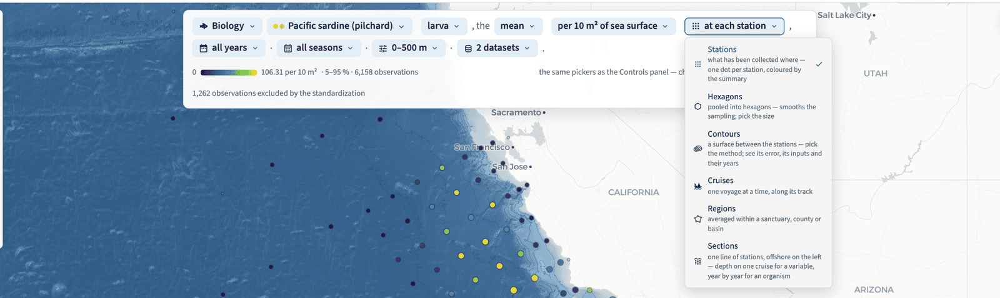{#fig-explore-sentence .column-body-outset}

### Select, Refine, Share {#sec-explore-controls}

The Controls panel is three steps in order (@fig-explore-controls).

**① Select** is what you are looking at: **Biology** or **Environment**, then the organism (a
taxon — species, genus or family) or the ocean variable, and the life stage that goes with it.
The picker opens folded by category, each category with its icon, how many items it holds and a
log-scale bar of how much data — type to search within it, or use the flat A–Z list. *View as*
holds the six lenses: the active one full size with a line of help under it, the other five as
icon slivers. *More options* is the disclosure that decides what is pooled: the summary statistic,
how counts are standardized (per 10 m² of sea surface, per 1000 m³ strained, or the raw count),
whether tows that were sampled and caught nothing count as zeros, one pill per dataset × stage,
and the *Sources* line naming every dataset the average pools. A statistic is averaged across
datasets that share the life stage and the standardization, and never across them — eggs are never
merged with larvae, counts never with densities.

**② Refine** narrows it: the years (typed, or dragged on the Time panel), the seasons as quarters,
the depth band (typed, or brushed on the Depth panel) and the datasets in view.

**③ Share** is everything that leaves the app: *Download data (zip)* — the summary and the
observations, the exact SQL against the release's object URLs, a README, the citations and
`reproduce.R` / `reproduce.py` that re-run the query; *Copy code* for SQL, R or Python; *Cite this
data*; *Copy link*; *Copy image* / *Download PNG* of the whole view with the selection, release and
URL stamped in the footer; *Register a product*, *Send feedback*, and *SQL and timing* for what the
browser actually ran.

::: {#fig-explore-controls layout-ncol=3}

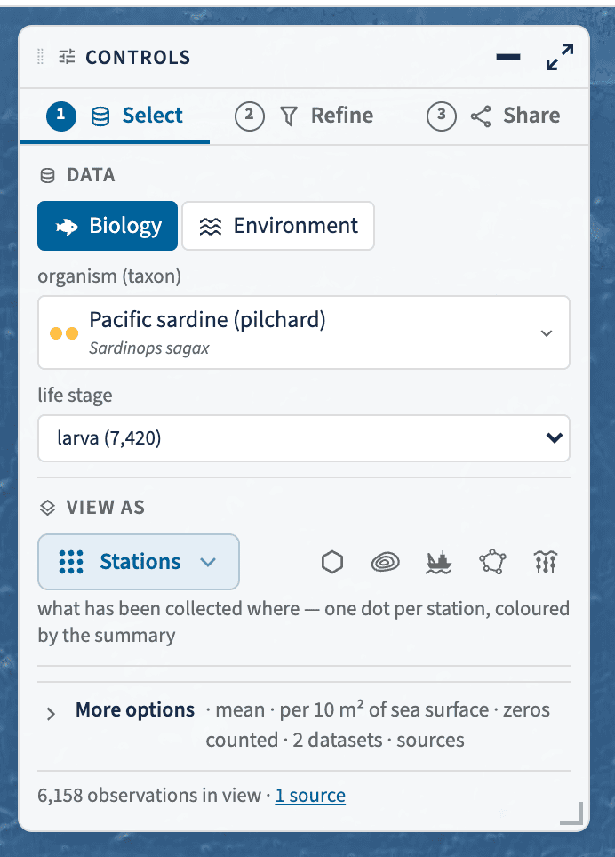{#fig-explore-select}

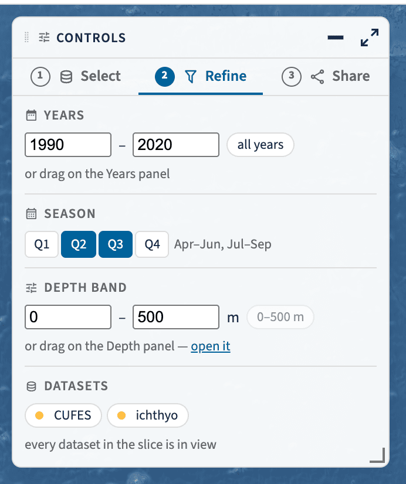{#fig-explore-refine}

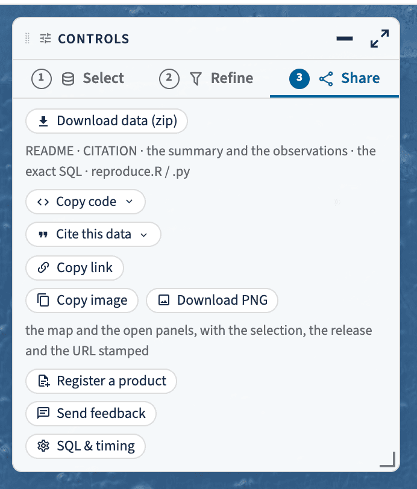{#fig-explore-share}

The three tabs of the Controls panel: choose what you are looking at, narrow it, then take it with
you.
:::

### Time, along the bottom {#sec-explore-time}

The Time panel (@fig-explore-time) is the whole record, not the filtered slice: it keeps every
year for context and shows the span you filtered inside it. Its modes are *observations* (how many
per year), *mean ± se* (the selection as a time series) and *cruises* (a year × month calendar of
what sailed). Drag across it to filter the map to a span of years.

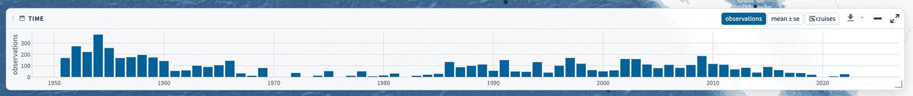{#fig-explore-time .column-body-outset}

### Depth, at the right {#sec-explore-depth}

The Depth panel (@fig-explore-depth) is the water column for the current selection: the profile
with its spread, in 10 m bins. Drag a band on it to slice the map to those depths. It starts
folded to a pill and it never opens itself — it lights up when a pick that was sampled at depth
arrives, and when a pick has no depth axis (a depth-integrated net tow) the pill says so instead
of moving.

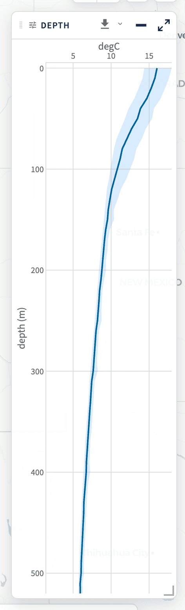{#fig-explore-depth width=22%}

## The six lenses {#sec-explore-lenses}

Six shapes of the same data, under the same selection and the same filters. Switching between
Stations and Hexagons travels the dots to their hexagon centres — the one animation that shows
what pooling does; every other change is a short cross-fade, and no lens carries dots it does not
explain.

### Stations {#sec-explore-stations}

One dot per station, coloured by the summary of what you chose (@fig-explore-anatomy). The
legend's 5–95 % window sets the colours, so a few extreme stations cannot flatten the rest. Click
a dot for the station's coverage card: every dataset measured there, by year and by month. This is
the lens for *what has been collected where*, and the one the app opens on.

### Hexagons {#sec-explore-hex}

The same summary pooled into H3 cells, with a size slider that runs from about 60 km to about 1 km
(@fig-explore-hexagons). Pooling smooths the sampling — the grid's repeat occupations stop
reading as isolated dots — and the size you pick lands in the URL as `res=`. The `hex_id` behind
it is the H3 index carried on every observation in the release ([The database](db.qmd)).

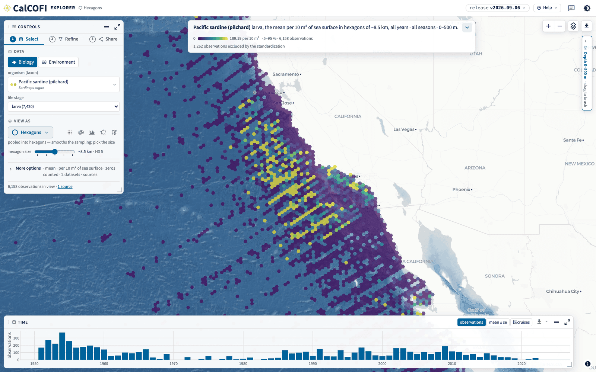{#fig-explore-hexagons .column-body-outset}

### Contours {#sec-explore-contours}

The Contours lens interpolates the point summary into a surface, in a Web Worker in your browser
(@fig-explore-contours). Four choices are yours, and all four are in the URL:

- **the method** — **IDW** (inverse-distance weighting, what the superseded Contour Explorer
  drew), **kriging** (an exponential variogram fitted to the points) or **spline** (a thin-plate
  spline, the GAM `calcofi4r::pts_to_contours_gam()` fits, over the station grid);
- **what it is fitted to** — **every site** (each cast, tow or site at its own position, repeat
  occupations pooled) or the **station grid** (one point per grid cell);
- **the surface** — the statistic itself, **its error** (the kriging standard deviation or the
  spline's standard error; IDW is a weighted average and has none), the observation density, the
  first or last year sampled, the 5th or 95th percentile, or their spread;
- **what is drawn over it** — the input points the surface was fitted to, and the level labels
  along the isolines.

Under the options, the fit reports itself: the leave-one-out RMSE, the variogram (nugget, sill,
range) or the effective degrees of freedom, and how long it took. The surface is blank beyond
60 km from any point and clipped at the coastline, so the map never extrapolates and never draws
ocean over land. `calcofi4r::cc_interpolate()` and `calcofi4py.interpolate()` are the same
algorithm, pinned to the browser's own output by a shared fixture, so a surface made in R or
Python matches the map cell for cell ([Access the data](data-access.qmd)).

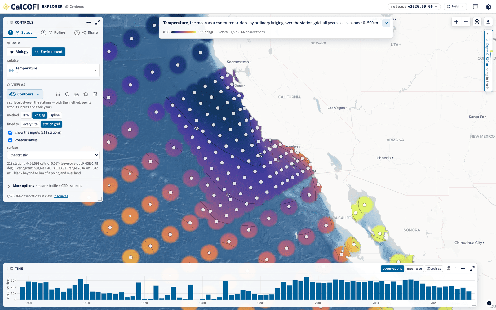{#fig-explore-contours .column-body-outset}

### Cruises {#sec-explore-cruises}

One voyage at a time (@fig-explore-cruises): its track, its station visits coloured by what you
picked, and the sampling events behind them. The *Cruise series* panel puts that cruise in the
whole record — every cruise's mean as a point, the one you are looking at highlighted — which is
how you see whether a cruise was warm or cold for its season without leaving the lens.

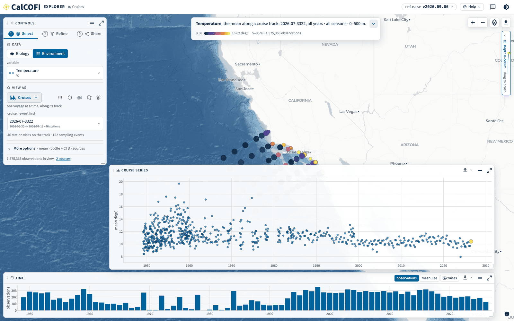{#fig-explore-cruises .column-body-outset}

### Regions {#sec-explore-regions}

The same summary averaged inside boundaries (@fig-explore-regions): pick a layer — sanctuaries,
protected areas, wind areas, counties, the CalCOFI regions — and each polygon is ranked as a pill
with its value and the number of observations behind it. Membership is exact, from the release's
own `sample_spatial` table rather than a bounding box, and a polygon with no data says so rather
than reading as a zero.

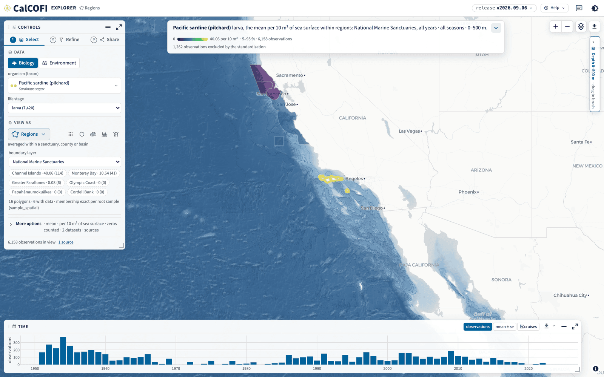{#fig-explore-regions .column-body-outset}

### Sections {#sec-explore-sections}

A section cuts one CalCOFI line, and **its y-axis is the realm** — this is the one lens whose
shape changes with what you picked.

For an **ocean variable** it is a **depth section**: the stations along the line across the
x-axis, depth down the y-axis, for **one cruise** (@fig-explore-section-env). The checkbox *difference from the 1993–2013 normal* subtracts the release's own
`climatology` table — the mean for that station, the cast's own calendar month and its 10 m depth
bin — so an anomaly here and an anomaly in [ctd-transects](https://calcofi.io/ctd-transects/)
cannot disagree ([The database](db.qmd)).

For an **organism** the tows are depth-integrated, so there is no depth axis: the lens draws a
**station-by-year** section — the same stations across the x-axis, years down the y-axis, across
**all cruises** (@fig-explore-section-bio). White is a station-year that was never sampled, not a
zero.

Both are laid out like the map — **offshore on the left, the coast on the right** — and both carry
two rulers on the x-axis: station number above, distance offshore below. They are one ruler,
because a CalCOFI line is equidistant at 7.386 km per station unit, so the axis is linear in both
at once.

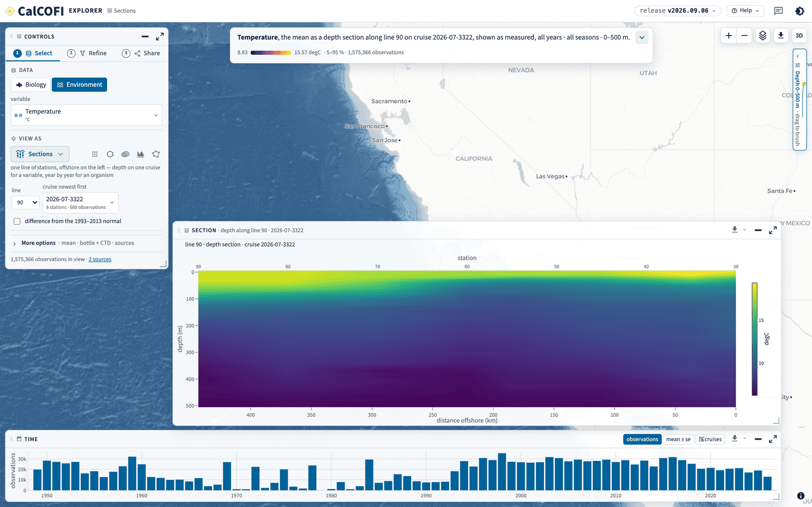{#fig-explore-section-env .column-body-outset}

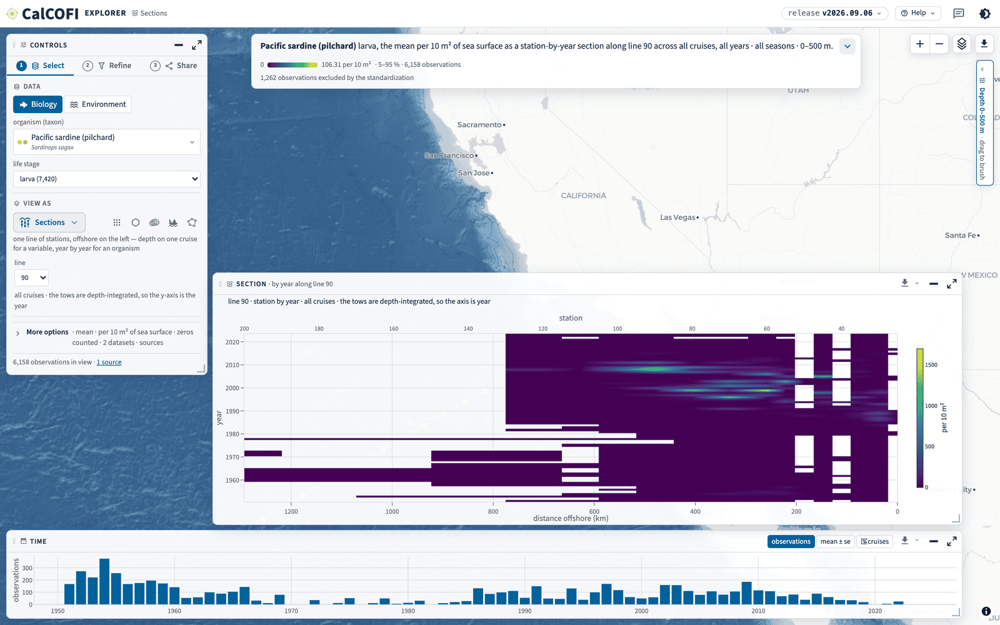{#fig-explore-section-bio .column-body-outset}

For an ocean variable, the **3-D** button hangs the same section as a curtain over the GEBCO sea
floor (@fig-explore-section-3d), with the vertical exaggeration in the URL; **2D** at the top right
brings the flat one back.

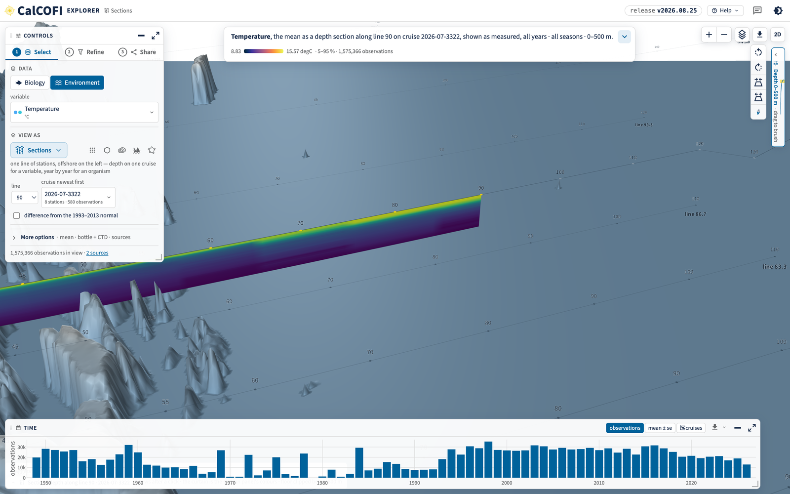{#fig-explore-section-3d .column-body-outset}

## Map layers {#sec-explore-layers}

The layers button on the map opens one card for everything drawn under and over your data
(@fig-explore-layers):

- **Data** — the selection as the lens draws it: on or off, its opacity, and its **colour ramp**
  (cmocean's ramps, viridis and GEBCO's, reversible). With no ramp chosen, the variable takes its
  cmocean convention — thermal for temperature, haline for salinity, ice for oxygen.
- **Sea floor** — GEBCO 2025 as three parts you can toggle separately (shaded relief, depth
  colour, contours) with its own opacity. It is the same bathymetry the 3-D curtain stands on.
- **Land** — the coast, drawn over the sea floor and the data from OpenStreetMap's land polygons
  (the same coastline the basemap's water comes from), so a 390 m bathymetry cell or a 10 km
  contoured cell never spills onto land, and the basemap's roads, county, state and country
  lines and labels stay on top. Off (`land=off`), the map is the earlier stack.
- **On the map** — the boundary layers *and* the Data row in draw order, top first, re-ordered by
  dragging a row or with ▲ ▼. Putting a boundary above Data draws it over your data; putting Data
  above it draws the data over the boundary. With Land on, the Data row is the sea surface:
  it and every row below it are clipped to the ocean, rows above it draw over the land too.
- **Add a layer** — the boundary registry by group: maritime zones, protected areas,
  administrative, ecological, energy and industry, and the *Reference* group — the undersea
  feature names of the IHO-IOC GEBCO Gazetteer (banks, basins, canyons, seamounts,
  escarpments, labelled at a zoom set by their rank) and, for comparison, Esri's raster ocean
  reference. The names are on from the start, above the data and absent from the legend;
  remove the row to turn them off (`layers=off` in the link).

Every choice — which layers, their order, their colour, fill opacity and line width, the sea
floor's parts and opacity, the land mask, the data ramp — is view state and lives in the URL, so a
shared link, a bookmark and a feedback report all reopen the same map. The boundary and reference
layers are PMTiles archives on `gs://calcofi-files-public/_spatial/`, built by
`ingest_spatial.qmd` from the registry `metadata/spatial_layers.csv` and listed per release in
`spatial_layers.json` (@sec-releases).

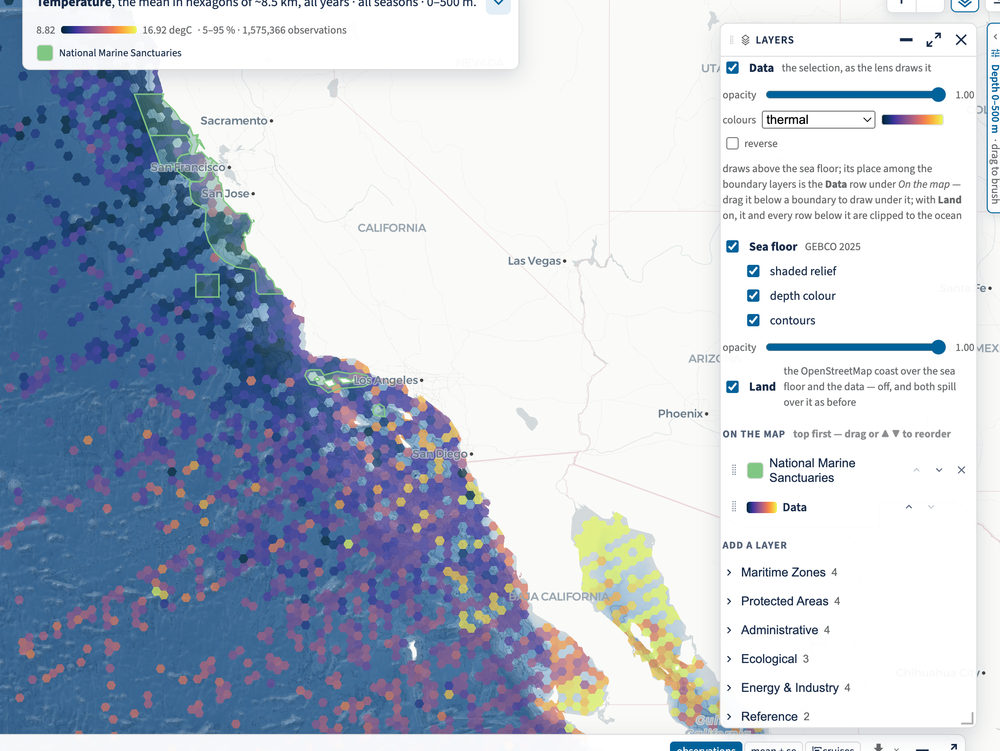{#fig-explore-layers .column-body-outset}

## Every pane, the same controls {#sec-explore-panes}

Every panel — Controls, Time, Depth, Layers and each lens result — is a floating pane with one
title bar and the same four controls (@fig-explore-pane): **move** it by dragging the bar (a
double-click sends it home), **collapse** it to a labelled pill on the nearest edge, **expand** it
to fill the map (`Esc` restores) and **resize** it from an edge or the corner grip. Positions are
remembered per browser and per viewport; which panes are folded or expanded lives in the URL.

The ⬇ on the bar exports that pane on its own:

- **PNG**, at 2×, with the selection, the release and the view URL stamped in a footer;
- **SVG**, vector, for a paper;
- **CSV**, the pane's own table — the same rows the download bundle carries, each with a
  `dataset_key` column, so a pooled row still names the datasets it pools.

Nothing leaves the app anonymous: every figure footer and every CSV names the datasets in view,
which is what makes the citations in [Cite this data](cite.qmd) possible to honour.

{#fig-explore-pane .column-body-outset}

## Share: every view is a URL {#sec-explore-share}

There is no view the address bar does not carry. *Share → Copy link* hands over the whole state —
including the map extent — and pasting one back reproduces it exactly, on any machine, without an
account. @tbl-explore-url lists the parameters; `src/state.ts` in
[CalCOFI/explore](https://github.com/CalCOFI/explore) is the authority that reads and writes them.

```{r}
#| label: tbl-explore-url
#| tbl-cap: The Explorer's URL parameters, grouped by what they set. Anything left out takes its default, so a link only carries what you changed.
librarian::shelf(dplyr, gt, tibble, quiet = TRUE)
tibble::tribble(
  ~Sets,                    ~Parameters,                              ~Example,
  "the lens",               "lens",                                   "lens=section",
  "an organism",            "taxon, stage, den, zeros",               "taxon=worms:217452&stage=larva&den=per_10m2",
  "an ocean variable",      "var",                                    "var=temperature",
  "the filters",            "years, q, depth, datasets",              "years=1990-2020&q=2,3&depth=250-350",
  "the summary",            "stat",                                   "stat=med",
  "hexagon size",           "res",                                    "res=5",
  "the contour surface",    "interp, grain, surface, inputs, labels", "interp=ok&grain=station&surface=se",
  "the section",            "line, anom, cruise, view, exag",         "line=90&anom=1&view=3d",
  "the region",             "layer, region",                          "layer=National+Marine+Sanctuaries",
  "the map extent",         "map",                                    "map=-120.4,34.1,6.2",
  "the map layers",         "layers, data, datao, ramp",              "layers=noaa_onms_sanctuaries,data&ramp=thermal",
  "the sea floor",          "bathy, bathyo",                          "bathy=relief,contours&bathyo=0.5",
  "the Time panel",         "strip, yview",                           "strip=mean",
  "the panes",              "show, hide, max",                        "show=depth&max=section",
  "a station's card",       "station",                                "station=<grid_key>",
  "which release",          "release",                                "release=vYYYY.MM.DD",
  "the theme",              "theme",                                  "theme=dark",
  "the welcome and tour",   "tour",                                   "tour=off",
  "the attribution modal",  "modal",                                  "modal=sources") |>
  gt() |>
  cols_align("left") |>
  tab_options(table.width = pct(100), data_row.padding = px(5), table.font.size = "0.92em")
```

Two of them are worth knowing by name. `?theme=dark` and `?theme=light` set the theme for one
view (@fig-explore-dark) — the app otherwise follows the theme you chose anywhere on calcofi.io —
and `?tour=off` suppresses the welcome card and the tour, which is what makes a screenshot of the
app deterministic (see [Products, brand and uptime](products.qmd)).

{#fig-explore-dark .column-body-outset}

The pattern also runs the other way: every dataset page on
[calcofi.io/datasets](https://calcofi.io/datasets/) links into the Explorer as
`?datasets=<dataset_key>`, and each of its variables as
`?datasets=<dataset_key>&var=<variable>`, so "show me this dataset, in this variable" is one
click from the record rather than a search.

## Help, the tour and feedback {#sec-explore-help}

*Help ▾* in the header (@fig-explore-help) holds the tour (`?` replays it), the *Explorer guide* —
this chapter — *Start here* (the welcome card, with its two doors and four worked questions),
*About* (what the app is, the release, the datasets with their providers and spans, the credits),
*Data Sources and Attribution* (one row per dataset, with citation, licence, DOI and contacts;
also reachable as `?modal=sources`), *Register a product* and the keyboard map.

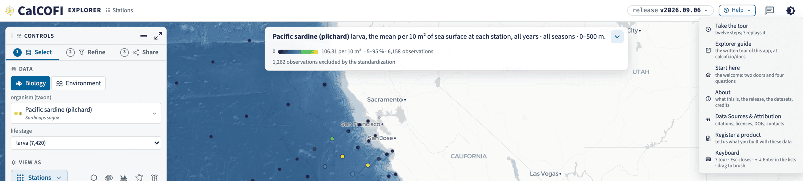{#fig-explore-help .column-body-outset}

The speech bubble beside the theme toggle is **feedback**. It captures the view you are looking
at, lets you mark it up — arrow, circle, rectangle, pen, text — and sends the picture with your
note, the view's URL, the release, the viewport and the theme: to the team by mail, to a sheet,
and as a public issue in the app's repository without your email address. That is the point of the
URL being the whole view: "that spike looks wrong" arrives as something anyone can open and see.
*Register a product* is the same dialog in its second form, for telling us what you built with
these data.

## One dataset

Every dataset in the database — and every one CalCOFI holds but has not yet ingested — has a page
at [**calcofi.io/datasets**](https://calcofi.io/datasets/): what it is, who made it, its years and
area, how to cite it, and every place it can be reached (the Explorer, the packages, ERDDAP, its
archive of record). The page is generated from the same record the portals read, so it is never a
copy of anything. [Metadata & the ingest loop](metadata.qmd) says where its words come from.

## One table, one query

- [**calcofi.io/db-schema**](https://calcofi.io/db-schema/) browses the schema of any release:
  tables, columns with units and descriptions, the entity-relationship diagram, the datasets and
  the measurement-type registry. [The database](db.qmd) and [Keys and integrity](keys.qmd) are the
  narrative it lacks.
- [**calcofi.io/db-query**](https://calcofi.io/db-query/) runs SQL against the release in your
  browser — a library of queries to start from, and a shell. [Access the data](data-access.qmd)
  shows the same queries from R and Python.

## The other applications

```{r}
#| label: setup
#| include: false
librarian::shelf(dplyr, gt, here, purrr, yaml, quiet = TRUE)
`%||%` <- function(a, b) if (is.null(a)) b else a
prod  <- yaml::read_yaml(here("data/products.yml"))
cards <- prod$products %||% prod
card_row <- function(p) tibble::tibble(
  key         = p$key,
  title       = p$title %||% p$key,
  section     = p$section %||% NA_character_,
  group       = p$group %||% NA_character_,
  live_url    = p$live_url %||% NA_character_,
  description = p$description %||% "",
  status      = p$status %||% "live",
  superseded_by = p$superseded_by %||% NA_character_,
  credits     = if (is.null(p$credits)) NA_character_ else paste(unlist(p$credits), collapse = ", "),
  added       = p$added %||% NA_character_)
cards_df <- purrr::map_dfr(cards, card_row)
title_of <- function(k) { t <- cards_df$title[match(k, cards_df$key)]; ifelse(is.na(t), k, t) }
status_text <- function(s, by) dplyr::case_when(
  s == "superseded" & !is.na(by) ~ paste0("superseded by ", title_of(by)),
  s == "superseded" ~ "superseded",
  s == "archived"   ~ "archived",
  s == "interim"    ~ "interim",
  TRUE              ~ "live")
apps_tbl <- function(d) {
  d |>
    dplyr::mutate(Status = status_text(status, superseded_by),
                  Product = live_url, name = title) |>
    dplyr::select(Product, name, Status, description) |>
    (\(tbl) if (knitr::is_html_output())
      tbl |> gt() |> fmt_url(columns = "Product", label = from_column("name")) |> cols_hide("name")
    else
      tbl |> dplyr::select(-Product) |> dplyr::rename(Product = name) |> gt())() |>
    cols_label(description = "") |>
    cols_align("left") |>
    tab_options(table.width = pct(100), data_row.padding = px(5), table.font.size = "0.92em")
}
```

The Explorer superseded the server-side applications that each showed one of its lenses; they
keep serving, and their cards on [calcofi.io](https://calcofi.io) say what replaced them. The table
reads the same cards.

```{r}
#| label: tbl-apps
#| tbl-cap: The applications on calcofi.io besides the Explorer, from the landing page's product cards.
cards_df |>
  dplyr::filter(section == "explore", key != "explore") |>
  dplyr::arrange(status_text(status, superseded_by), title) |>
  apps_tbl()
```

## Student contributions

Student teams at UCSB, UCLA and UCSD have built portals, dashboards and stories on the database;
their repositories are archived and their sites keep serving.

```{r}
#| label: tbl-students
#| tbl-cap: Student contributions, from the landing page's product cards.
cards_df |>
  dplyr::filter(section == "students") |>
  dplyr::arrange(dplyr::desc(added), title) |>
  dplyr::mutate(description = ifelse(is.na(credits), description, paste0(description, " — ", credits))) |>
  apps_tbl()
```

## Reports built on the data

The [Channel Islands National Marine Sanctuary condition report](https://noaa-onms.github.io/cinms)
reads CalCOFI through `calcofi4r` — its [forage assemblage
page](https://noaa-onms.github.io/cinms/modals/forage-assemblage.html) is a worked example of a
report that regenerates from the release. The [status chapter](status.qmd) records what each
contract period delivered.
