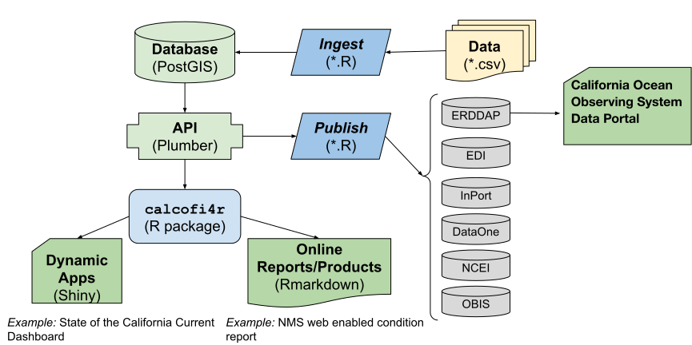

# Process

```{=html}
<!-- Edit here:
[software architecture v2 | calcofi - Google Drawings](https://docs.google.com/drawings/d/10gMrYC7wIo0ahz94KjGh8rc-vP1Nim1MI-hZdUK9BL4/edit)
[software architecture | calcofi - Google Drawings](https://docs.google.com/drawings/d/11lyFRPZV5Jtk7RoNFe4zRjxUvSp9ZH56p2PSdDWfEcs/edit)
-->
```

{#fig-sw-arch}

The original raw **data**, most often in tabular format [e.g., comma-separated value (\*.csv)], gets **ingest**ed into the **database** by R [scripts](https://github.com/CalCOFI/scripts) that use functions and lookup data tables in the R package [**`calcofi4r`**](https://calcofi.github.io/calcofi4r/reference/index.html) where functions are organized into _Read_, _Analyze_ and _Visualize_ concepts. The application programming interface (**API**) provides a program-language-agnostic public interface for rendering subsets of data and custom visualizations given a set of documented input parameters for feeding interactive applications (**Apps**) using Shiny (or any other web application framework) and **reports** using Rmarkdown (or any other report templating framework). Finally, R scripts will **publish** metadata (as [Ecological Metadata Language](https://docs.ropensci.org/EML)) and data packages (e.g., in Darwin format) for discovery on a variety of data _**portals**_ oriented around slicing the tabular or gridded data ([ERDDAP](https://coastwatch.pfeg.noaa.gov/erddap/information.html)), biogeographic analysis ([OBIS](https://obis.org)), long-term archive ([DataOne](https://www.dataone.org), [NCEI](https://www.ncei.noaa.gov)) or metadata discovery ([InPort](https://www.fisheries.noaa.gov/inport/)). Every one of those datasets — and every one still awaiting ingestion — also has a page of its own at [calcofi.io/datasets/](https://calcofi.io/datasets/): the **dataset catalog**, generated from the same database, joining every portal it reaches (see [Portals](portals.qmd)). The **database** will be spatially enabled by PostGIS for summarizing any and all data by _**Areas of Interest**_ (AoIs), whether pre-defined (e.g., sanctuaries, MPAs, counties, etc.) or arbitrary new areas. (@fig-sw-arch)

That figure is from 2022. The **publish** box on it is now real, and it is generated rather than
scripted by hand: at every release one record per dataset (`datasets.json`) and one EML document
per dataset are written, and from those two files come the dataset pages, the DCAT and STAC
catalogs, the Darwin Core archives for OBIS, the EDI packages and ERDDAP's own metadata
(@fig-catalog-flow). How a provider's words get into that record — and what they edit to change
it — is the subject of [Metadata & the ingest loop](metadata.qmd).

```{mermaid}
%%| label: fig-catalog-flow
%%| fig-cap: "Everything a portal sees is generated from one record per dataset. The dotted boxes are catalogs run by others; each is pointed at a static file we already publish."
%%| file: diagrams/catalog_flow.mmd
%%| fig-width: 9
```


